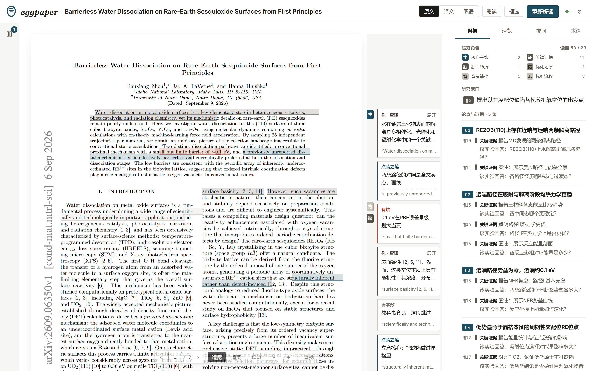
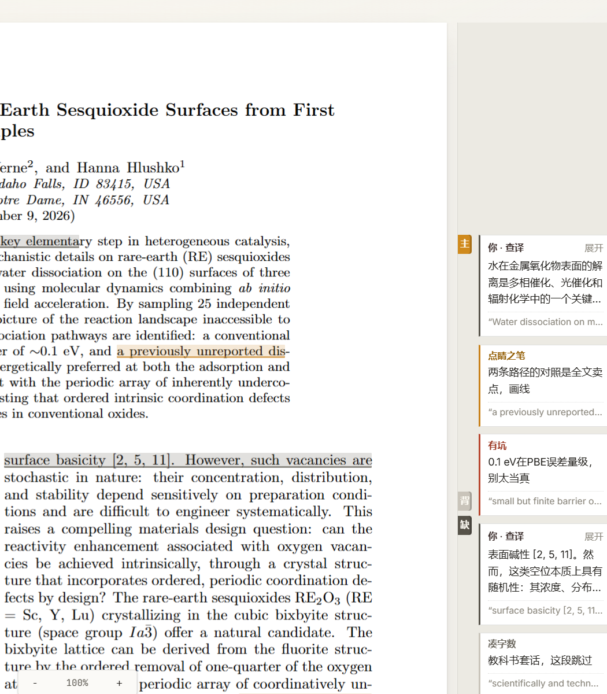
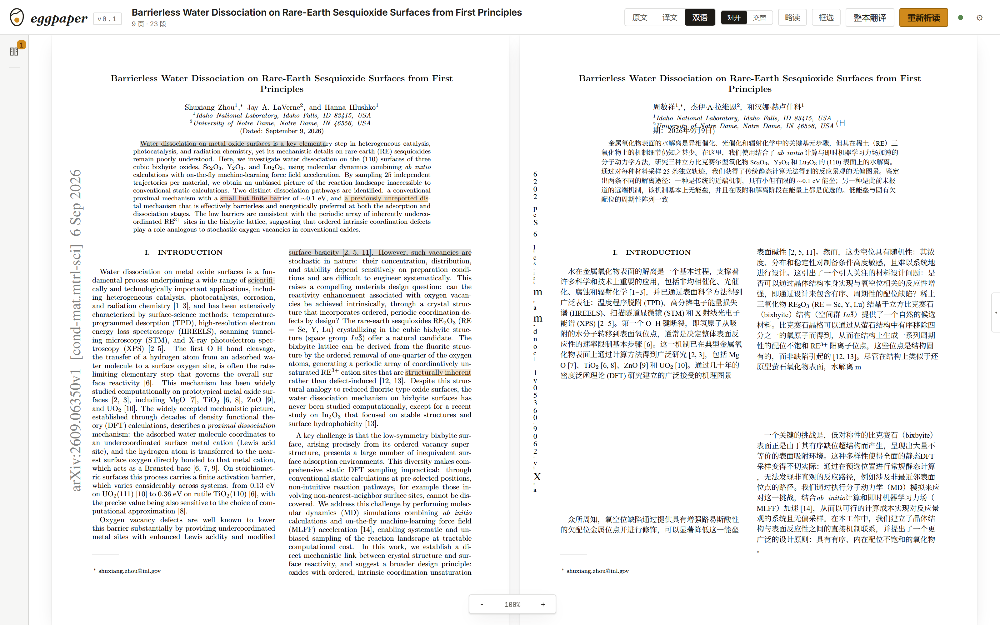
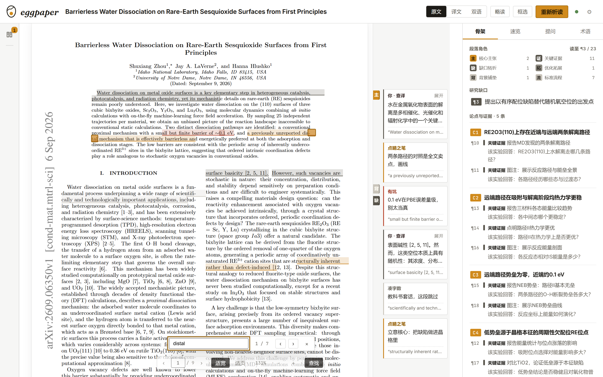
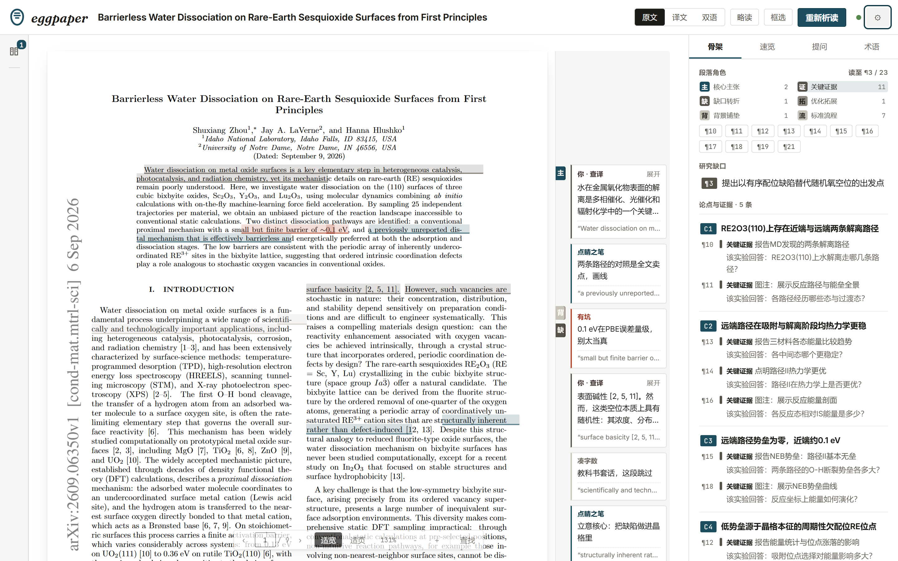
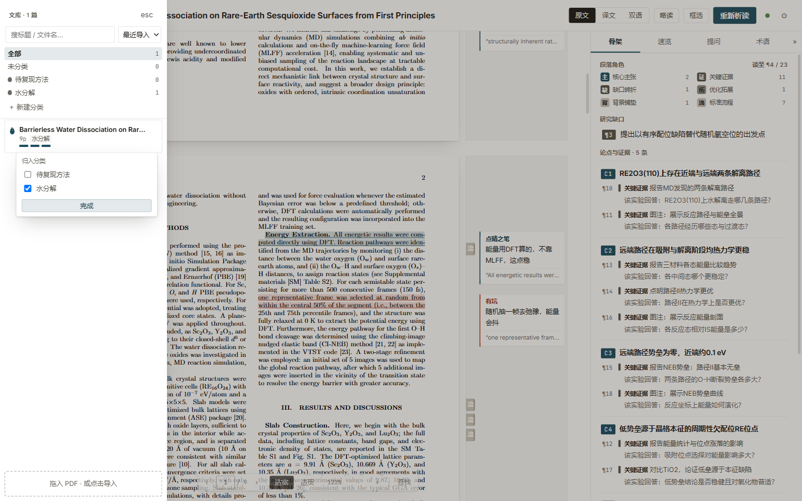
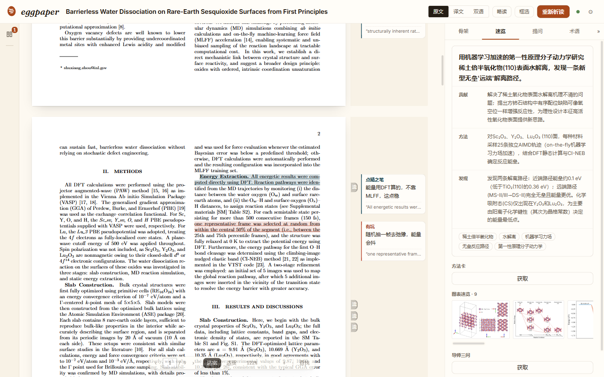

# 🥚 eggpaper

> Crack the paper, read the marrow. 剥开论文的壳，直接读论证的芯。



**eggpaper** 是一个本地优先的轻量科研文献阅读器。它不做"更多翻译"，做两件别家没做的事：

1. **术语一致的翻译**——一份个人术语表贯穿划词、段落、整本、总结、问答全部链路
2. **论证骨架 + 眉批**——从作者写作意图解析论文：哪句是核心主张、哪个实验只是对照、哪段是凑字数的样板、哪里有 AI 痕迹

文献、术语、批注全部留在本机；无账号、无订阅，LLM 用你自己的 key（DeepSeek / GLM / 本地 Ollama，任意 OpenAI 兼容端点）。

## 功能总览（全部已实现并实测）

### 读

- **翻译三模式**：`原文` / `译文`（整版中文，排版公式保留）/ `双语`（对开：左英右中成对滚动 · 交替：一页原文一页译文）
- **略读模式**（f）：非核心段蒙纱成波浪，核心段琥珀条标记，`j/k` 只在主干上跳
- **位置记忆**：刷新、重开、换篇，回到你离开的那一行
- **阅读器基本盘**：适应宽度 / 适应页面 / 实际大小 / 百分比微调；页码直达 + 上下页（`PageUp`/`PageDown`）；论文内查找（`Ctrl+F`，命中逐处高亮、逐个跳转）。**`Ctrl+滚轮`只缩论文**（缩完光标底下那个字留在原地），`Ctrl+±` 才是浏览器缩放；论文缩放不动顶栏右栏
- **读进去的那几下**（不加说明文案，只给动作）：视口中心换段时，纸下缘轻轻报一句这一段是什么（`¶8 · 标准流程`）并给「译这段 / 问这段」，自己会走；书桌右缘一根发丝显示阅读进度；打开一篇有眉批的论文时，划线与批注卡自己"画"进来一次
- **护眼底纹**：纯白（默认）/ 豆沙绿 / 浅青绿 / 米黄，设置里点一下立刻换。纸面用 multiply 洗色而不是整屏蒙版——底变绿，字仍然是黑的（正文对比度 16.9:1），清晰度一分不让

### 懂

- **论证骨架**：一行角色图例看全段落构成（背/缺/主/证/对/流/拓/限，首字+条数）；点一类角色摊开它落在哪几段，逐一跳转（一个角色往往十几段，只跳第一段等于把其余位置藏了）。缺口 → 论点与证据链排版化列表，跟随滚动高亮"你读到哪条论点"；页边一列同名**角色书签**，点开即该段的角色卡——写全称、写出处（¶号+页码）、可改判、可回退
- **眉批**：句级人性化批注——妥协让步 / 凑字数 / 生硬别扭 / 多余重复 / 吹嘘过头 / **AI 痕迹** / 点睛之笔 / 有坑。像实验室师兄在你肩膀边上说话。引文**按句子逐行划线**（跨几行就是几个块，行内划多长就是多长），点引文直接跳到纸上那一句；模型把引文改写过一两个词时，退到能对上的最长前缀，划线只盖真实存在的字
- **划词即钉**：划词气泡一键把译文钉到页边，或直接就这段提问

### 问

- **对话式提问**（右栏「提问」，照 DeepSeek / 豆包网页版的样子做）：回答**逐字流式**吐出来，中途可「停止生成」（已经吐出来的半截留着）；每条消息悬停出「复制 / 重新生成 / 删除」；**一摊对话一个上下文**，可新建 / 切换 / 改名 / 删掉整摊，标题自动取第一个问题。答案里的 ¶ 号与末尾「依据」角标都可点回原文。**上下文随聊随管**：本会话全部问答都在窗口里，删掉的那条立刻不在；超出预算时较早的轮次压成摘要（保留结论、数字、依据段号、术语译法与未解决的问题）而不是被截断
- **论文专属推荐问题**：析读完成后自动生成 4 个最值得追问的问题（审稿人视角，不是泛泛之问）
- **导入即通读**：PDF 拖进来，骨架与简报在后台自动生成，打开即有
- **框选视觉问答**：`r` 进入框选模式（顶部常驻提示 + 退出按钮，Esc 随时退出），圈住公式/图表/表格直接问（讲解此图 / 讲公式 / 挖表格），答完钉在页边的正是你圈的那块地方；图表灯箱里也能「问这张图」（可左右翻图）。回答按 markdown 排版，长回答框内滚
- **导师三问**：站在答辩委员会角度自动生成 3 个最可能被问住的问题，每个配过关要点提纲
- **方法卡**：把 Methods 整理成"目标/体系/条件/步骤/注意事项"的可复现 protocol
- **本文缩写表**：自动抽取缩写首现展开，一键收进术语表
- **该实验回答**：每条关键证据标注它直接回答的问题，论证链从「是什么」升级为「为什么」
- **图表速览**：论文插图自动抽取成画廊，灯箱放大、一键跳回原文所在页
- **导出**：阅读笔记一键导出 Markdown（一眼卡+论证骨架+眉批查译）、术语表导出 CSV / Anki TSV

### 沉淀

- **文库**：分类（Zotero 的 collection 语义——一篇可同时属于多类，点分类即筛选，条目可直接拖进去或点左侧的 `＋` 勾选）+ 标题搜索 + 三种排序（最近导入 / **最近阅读** / 标题）。每一行只有标题与**第一作者**（PDF 里认出来的，认不出就不显示）。批注、骨架、问答全部落在本机 SQLite，下次打开原样都在
- **术语本**：内置化学/材料种子术语；划词一键收进；译名在所有输出中强制一致；筛选管理
- **页边即资产**：查译、段译、眉批都钉在页边（统一卡片、可展开、可移除；同段重钉自动更新，框选答疑按区域各自成条），跟随论文保存。长批注展开时下方批注整体下让——永远不叠、不裁、不窜出纸张。**页边宽度按需给**：有批注才占满 184px，只有书签收成 24px，图层全关一点都不留（论文当场宽出近 200px）
- **骨架 mini-map**：右栏论证链跟随滚动高亮"你读到哪条主张了"
- **右栏四分工**：骨架（论证链 + 眉批速览）· 速览（一眼卡 + 方法卡 + 图表 + 导师三问）· 提问 · 术语（本文缩写 + 术语表）；**宽度可拖**（双击复位，268–760px），面板可以整个收起
- **整本双语导出**：pdf2zh 引擎（bing/google/deepl/openai 可配），奇页原文偶页译文
- **蛋仔皮肤**（可选，设置里切）：暖底 + 圆角 + 一颗圆滚的蛋标记。玩心只借"动作"，不借配色与形象

### 键盘流

`j/k` 段间步进 · `t` 译当前段并钉页边 · `s` 译划选 · `f` 略读 · `r` 框选问 AI · `1/2/3` 三模式 · `/` 提问 · `x` 折叠右栏 · `g l` 文库 · `Alt+←` 返回原位 · `Esc` 收起所有浮层/退出框选 · `?` 快捷键卡

## 截图

| 阅读（页边双声音：AI 眉批 + 你的查译） | 双语对开 |
|---|---|
|  |  |

| 论文内查找 | 段落角色摊开全部位置 |
|---|---|
|  |  |

提问：流式回答 + 可点 ¶ 引用 + 每条消息的复制/重新生成/删除 + 多会话。


文库：分类 + 搜索 + 排序，点条目右上角的数字归入分类（也可以直接拖进去）。



窄窗（半屏 / 小笔记本）：右栏不再占版面，改成浮在书桌上的抽屉，论文因此占满整个书桌宽度。


护眼底纹（豆沙绿）：


蛋仔皮肤（可选）：暖底 + 圆角 + 一颗圆滚的蛋。



## 为什么做

市面上要么是云端订阅的重方案（小绿鲸/ReadPaper），要么是只有翻译的开源引擎（pdf2zh），要么是贵且不可溯源的通用 PDF 问答（ChatPDF 类）。eggpaper 补的是：**本地轻量壳 + 术语全链一致 + 论证骨架**。骨架层对应 argumentative zoning / rhetorical roles 研究，句级眉批连学术原型都少见——这是产品的身份标识。

## 运行

```bash
# 后端（Python 3.10+）
pip install -r backend/requirements.txt
python backend/main.py                    # 127.0.0.1:8430

# 前端
cd frontend && npm install && npm run dev # http://localhost:5173
```

首次打开：设置 → 填任意 OpenAI 兼容 base_url + key + model → 测试连接。不填 key 也可用（演示模式）。

设计文档：[design.md](docs/design.md)（定位与取舍）· [ux.md](docs/ux.md)（布局与交互）· [visual.md](docs/visual.md)（视觉与动效）· [plan.md](docs/plan.md)（计划与走查）。

## License

[AGPL-3.0](LICENSE) —— 与 pdf2zh/BabelDOC 同生态。请勿闭源套壳。

## 关于标记


一枚**印章**：椭圆环 + 环内几行字（末行短一截）。环是纸的边界，字是内容——印章正是批注本自己的语言；而椭圆环又刚好是蛋的轮廓，名字里的 egg 靠形状带出来，不靠画一只蛋。小尺寸另备一稿（环加粗、字条三条），128 → 16px 都立得住。

换「蛋仔」皮肤时它会变成一颗圆滚的蛋（+ 一道高光 + 三条白字条）。至于「蛋仔派对」那个游戏本身：玩心只借它的**动作**（空态拖入时原地弹跳、析读完成时滚半圈），不借它的配色和形象——糖果色和 Q 萌吉祥物与「明亮的批注本」不是一套调性，而且那四个字是法院认过的未注册驰名商标，靠太近不划算。
