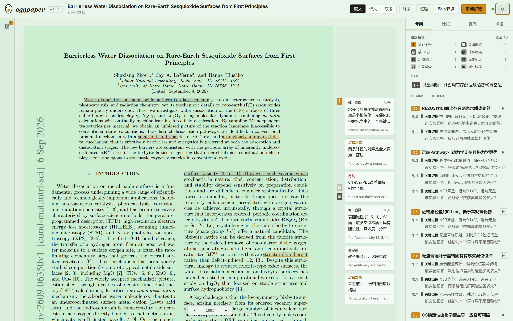
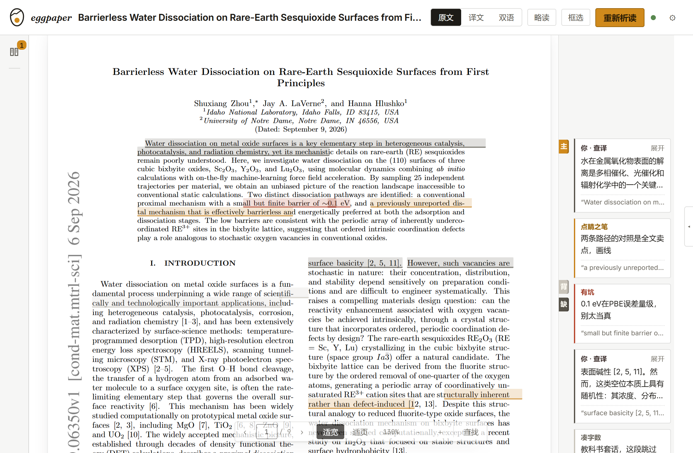
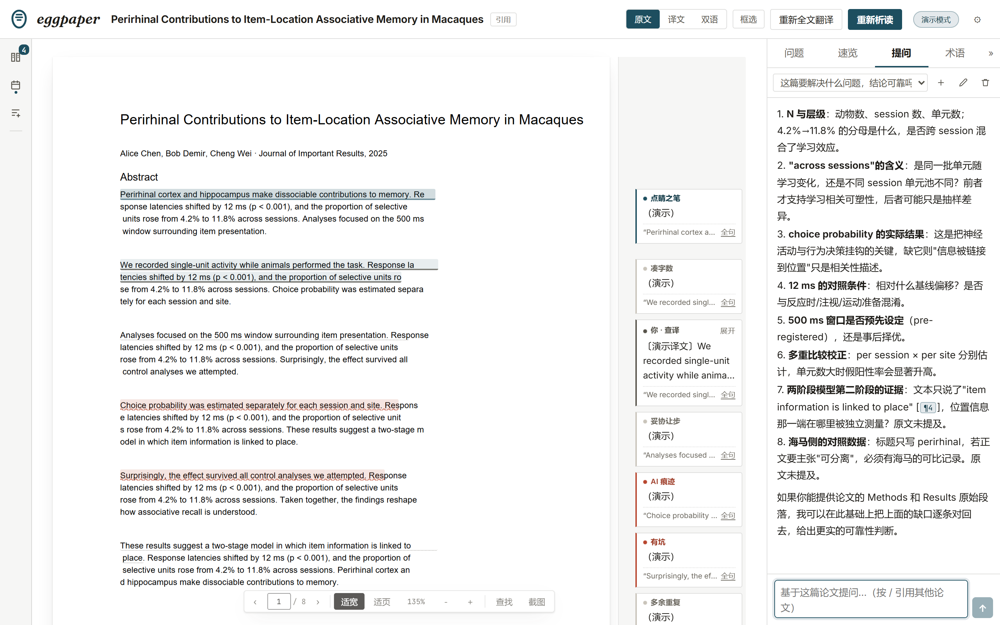

# eggpaper 视觉与动效规范

> v0.1 · 2026-09-11。上位：[design.md](design.md)（语言：明亮的批注本）、[ux.md](ux.md)（交互逻辑）。本文把"美观度、设计感、丝滑度"落成可直接实现的 token 与清单。

---

## 1. 字体：两种声音 + 一个署名

排版的核心思想：**每个字体家族只有一种职责**，用户不需要读懂文字就知道这块内容是什么性质。

字体越少越好。曾有第四种"人声"字体（楷体）用于眉批，实测偏细偏干瘪、和界面互相打架，**已废**——人味靠颜色、行高和位置来表达，不靠换字。中文一律落到系统雅黑（饱满、不生僻、人人看着习惯），拉丁字母由 Inter 承担。一屏内家族 ≤2。

| 声音 | 家族 | 只用于 | 字号/行高 |
|---|---|---|---|
| 工作声（sans） | Inter Variable + 微软雅黑 | 全部 UI 控件 + 全部内容文本（骨架链、一眼卡、问答正文、**眉批与批注**） | 13–14.5px / 1.55–1.7 |
| 编号声（mono） | JetBrains Mono | **只管编号与代码位**：¶号、页码、C1/C2、kbd、百分比、版本号 | 10.5px |
| 品牌声（serif italic） | Fraunces italic | **仅 wordmark 一个词**，别处禁用 | 21px |

**字号阶梯：四档 + 一个 display，别再加第五档。** 阶梯之外只有两件事，都在下面写清楚了：右栏整栏抬一档、「读的一档」。

| token | 值 | 只用于 |
|---|---|---|
| `--fs-display` | 21px | 仅 wordmark 与空态标题 |
| `--fs-xl` | 15px | 文档标题、主张、一眼卡主句、弹窗标题 |
| `--fs-md` | 13px | 全部正文与控件（批注、问答、按钮、输入） |
| `--fs-sm` | 12px | 次级：证据说明、术语行、提示、开关 |
| `--fs-xs` | 10.5px | 微：标签、¶号、页码、徽标 |
| `--fs-read` | 14.5px | **只给"真的要读进去"的整段话**：五问答案、证据说明、一眼卡正文、聊天正文 |

**`--fs-read` 不是第五级阶梯**，它划的是"读"与"操作"的界：`--fs-md` 管控件和短标签，`--fs-read` 管成段的文字。判据一句话——这段字是不是要连着读三行以上，是就用它。

**右栏整栏抬一档**：`.rail-right` 内把 `--fs-md` 覆写成 14px（`--fs-xl` 16 / `--fs-sm` 12.8 / `--fs-xs` 11）。右栏是"读"的地方，不是工具栏；左栏、顶栏、弹窗仍是 13px。四档之间的比例不动，所以它不算加档。

**设置里的「字号」（小 / 标准 / 大 / 特大 = 0.93 / 1 / 1.09 / 1.2）**：六个 token 全部写成 `calc(基准 * var(--fs-scale))`，设置只往 `<html>` 上写这一个变量，一乘全乘。**论文正文不动**——纸上那层字是 pdf.js 按视口比例写死的内联 `font-size`，不认 CSS 变量（这就是"除了论文"能成立的原因）。原生像素值（图例色块 16px、证据 ¶ 号列 22px、停止键 9px）也一律写 `calc(… * var(--fs-scale))`，否则字号一放大它们最先裂。

小节标签过去是"等宽 + 大写 + 0.13em 字距"，一屏几十个小灰字全在抢注意力，是"繁杂"的主因——现已改回正常字体（600 字重 + 0.04em 字距），等宽只留给编号。实测全界面只剩 5 种字号（原先 17 种）。

**位置规则**：标签一律在内容上方，不放旁边（减少横向扫视）；右栏内容左对齐、行长 ≤34em（中文阅读最佳）；间距走 4px 网格（4/8/12/16/24）；标题类字距 -0.01em，¶号与页数用 `font-variant-numeric: tabular-nums`。

## 2. 配色：纯白的纸

底色就是**纯白**。不做"四层明度"——分层靠发丝线和页面自己的阴影，不靠灰，更不靠黄。

```
桌面 --paper      #FFFFFF
沟槽 --paper-deep #F6F6F5   （左栏、页边批注带——只留一丝，让沟槽看得出在哪）
面板 --card       #FFFFFF   （顶栏、右栏）
内容 --card-2     #FFFFFF   （论文页、卡片、气泡、弹窗）
```

- **发暗发黄的历史**：v2 用暖黄纸（#EFE8D8）+ 噪点颗粒层，想做"台灯下的纸"，实测偏昏暗、像旧纸；v3 改成亮灰（#F4F2ED）仍被用户判定"看着累"；v4 直接纯白，颗粒层早已删除。**纸的颜色不是风格，是光线**——要暖可以开护眼底纹，那是一个用户显式选择的开关，不是默认值。
- 纯白底下，论文页与桌面同色，靠 `--shadow-page` 浮起来；沟槽留 `#F6F6F5` 一丝灰，否则页边批注带和桌面分不开。

### 护眼底纹（设置里切换）

四个档：**纯白（默认）/ 豆沙绿 / 浅青绿 / 米黄**。三个护眼色取自流传最广的经典值——豆沙绿 `#C7EDCC`、浅青绿 `#CCE8E8`、米黄 `#F5F5DC`（Office 2003 那一脉）。**要说清楚：ISO/IEC 9241、WHO、AAO 都没有认证过任何"护眼标准 RGB"**，这些值来自历史惯性和"低蓝光、低饱和、看起来柔和"的直观理由；真正管用的是亮度、色温、看远处休息（20-20-20），颜色只是微调。所以这里给的是"可选项"，不是"药方"。

怎么上色（关键设计）：**在纸面上盖一层 `mix-blend-mode: multiply` 的色膜**（`.care-wash`），不是给整屏加蒙版，也不是调 `filter`。

- multiply 的性质正好对上需求：**只乘"底"，白纸乘成护眼色，黑字乘完还是黑字**。实测纸面 `#CDEFD1`（≈ 豆沙绿）时正文对比度仍有 **16.9:1**，比纯白纸的 21:1 只差一点点——开着护眼，一个字也不会变糊。整屏蒙版和 `filter` 都会连字一起洗掉对比度，所以都不用。
- 桌面/面板跟着换成同色系的浅底（桌面比纸面更浅，纸才浮得起来），整窗都是一个色场，不会剩一大块白刺眼。
- `.page` 加 `isolation: isolate`，把洗色圈在纸内，不渗到桌面。
- 表头底色（`--veil`）也进 token：护眼档跟着纸色换，深浅始终成套。

对比度不是估的：`tools/contrast_check.py`（已入库）把三档底纹 × 三级墨、以及洗色后的纸面逐个算出来。三级墨中最弱的 ink-3 在**三档护眼底的最深处**是 4.56:1（顺带发现 ink-3 原来是 `#8a867c`，在纯白和护眼底上都只有 3.2–3.6，小字不达标；已压到 `#6b675e`）。

- **墨色只许三级**：ink `#1D1B17`（正文，纯白上 17.2:1）/ ink-2 `#55524A`（次级，7.8:1）/ ink-3 `#6B675E`（micro 标签专用，最差 4.56:1）。禁纯黑。
- **强调色只有一个，而且是墨色不是金色**：靛青 `#1D4E5F`（深档 `#123A47`）。用在主按钮、当前态、高亮底、品牌标记、核心主张那档色标上，禁止大面积铺。

  为什么换掉原来的琥珀 `#D08A1C`：① 大面积铺开就是用户说的"屎黄"；② **白字压在琥珀上只有 2.86:1**，主按钮其实一直不达标（换色后 9.10）；③ 调研过的"高级感"配方是低饱和 + 中性色主导 + 彩色只留一个（60-30-10），深蓝/藏青配中性灰是公认最稳的一组，靛青比纯蓝更接近墨水的颜色。
- **色标只表达一件事：该给多少注意力。** 不是八个色相，是四档——一个彩色 + 三级灰。

  | 档 | 填充 | 用在哪 | 色块字色 | 正文色 |
  |---|---|---|---|---|
  | 核心主张 | `#1D4E5F` | 唯一彩色（= 强调色） | `#FFFFFF` (9.1:1) | `#123A47` |
  | 论证主干（证据/缺口） | `#57534A` | 深灰 | `#FFFFFF` (7.7:1) | `#1D1B17` |
  | 外围与让步（对照/拓展/局限） | `#8E8A80` | 中灰 | `#26231E` (4.5:1) | `#55524A` |
  | 铺垫与流程（背景/标准流程） | `#C9C4BA` | 浅灰 | `#26231E` (9.0:1) | `#6F6B62` |

  为什么砍掉八个色相：**人能一眼解码的颜色上限是 3–4 个**。八个色相谁也记不住，"对照参比 vs 优化拓展"这种细类本来也不是扫一眼需要知道的。颜色不该去区分记不住的东西——它只该回答"这段是全文的芯，还是铺垫"。所有色块/字色对比度均过 WCAG AA 4.5:1（实测 9.1 / 7.7 / 4.5 / 9.0）。

  眉批用同一套逻辑：值得读（靛青）/ 要当心（朱红）/ 是噪音（浅灰）/ 你自己钉的（深灰）。

  （原来右栏有一张"段落角色"图例，是这套色块的样本；页边书签和角色卡一起删掉之后，这套色标只在问题②的证据行里出现，那里是文字标签 + 色条并排，不再需要图例。）
- **阴影 = 悬浮 = 暂时的**。静态布局只用发丝线+留白分隔；shadow 只给 popover/modal/拖拽悬停这类"临时浮起"的东西。这条是"设计感"的最高纪律。




## 3. 品牌标记：一枚印章（可选一颗蛋）


**形状**：椭圆环 + 环内几行字（末行短一截——真实的段末就是短的）。环是纸的边界，字是内容；印章正是批注本自己的语言，而椭圆环又刚好是蛋的轮廓，名字里的 egg 靠形状带出来，不靠画。

**为什么推翻"画一只蛋"**：那只蛋（哪怕加了裂缝）是**字面图标**。字面图标有三个死结——缩到 16px 只剩一坨、永远会被读成水滴或卡通蛋、换个产品名就完全失效。上一版真被用户读成了"水滴"。

**几何**：上下两个半椭圆在最宽处相切（上 ry 34 / 下 ry 42，所以钝端朝上、下端收），环内字条的行宽按椭圆在该高度的内接宽度递减，任何一档都不顶到环。

**小尺寸一稿到底**：只有一套基准几何（三字条，按目标尺寸解缝），`EggMark.vue` 自适应任何一档，实测 128 / 80 / 48 / 32 / 24 / 16px 都立得住。

**试过并否掉的方向**：掀盖的蛋（读起来像"戴帽子的蛋"）、实心蛋横切一刀（像贝雷帽）、文字条堆成蛋形（像汉堡菜单）、实心蛋挖个洞（像贝加圈）。留下的这版最耐看，也最好缩。

**只有这一枚标记，没有第二套皮肤**：皮肤做过一版（换底/墨/主色/圆角 + 换成一颗圆滚的蛋），后来整块删掉了——一套设计系统只该有一副面孔，多一套就要多维护一套对比度、多一套圆角、多一套"这个色块在暖底上还看得清吗"。玩心只借「动作」，不借「样子」（见 §5）。

## 4. 小元素巧思（全部服务"批注本"隐喻，克制执行）

1. **页边只住两样东西**：批注卡（钉在它引的那句话旁）和引文划线。段落角色曾经在页边挂一列"书签片"（背/缺/主/证/对/流/拓/限），2026-09-12 删掉了——同一套分类当时有四个出口（书签、角色卡、右栏图例、导出汇总），读者一个都不需要，而它把真正要读的批注挤在一条窄边里。角色如今只在后台支撑五问与眉批的生成。
2. **眉批划线 = 真的划在字上**：引文高亮不是"整段涂底"，是把引文对回字符后**逐行**画——跨几行就是几个块，行内划多长就是多长。和正文一样精确，才经得起"这句到底在哪"的核对。
3. **析读进度 = 笔画下划线**：不用进度条，一根发丝线像下划线一样自己画过去，旁边 mono 数字"读至 ¶13"随滚动更新。
4. **拖入时印记原地弹跳**：空状态拖拽悬停时，印章做蛋仔式的蓄力—起跳—落地压扁（squash & stretch，1.05s 循环）——剥壳隐喻的动作化，只在 dragover 态。
5. **完成时印记滚一下**：析读完成 / 整本翻译完成时，wordmark 里的标记半圈来回滚一次（0.68s，`transform-origin: 50% 85%` 所以是"底边着地滚"而不是原地自转）。彩蛋级，别处不用。
6. **highlight 描画**：眉批引文高亮以 scaleX 0→1 从左向右"画"出来（300ms），像被人拿笔当场划的。
7. **旁批是钉子不是纸**：展开一条长批注时，下方批注按实测高度整体下让，页边随之变长——批注永远不叠、不裁、不窜出纸张。长正文在卡内滚动（≤240px），卡片高度由渲染后实测决定，不靠估算。
8. **页边宽度是有话才说的**：批注带只在"真有批注要放"时占满 184px（实测同一篇论文 156% → 188%），关掉眉批图层一点都不留。空着的页边不是留白，是浪费。
9. **问题先出现，答案点开才看**：右栏问题页签是五行问题（①要解决什么、为什么 / ②怎么解决的 / ③还有什么没解决 / ④还能做什么 / ⑤换个学科怎么看），默认全部收起——读一篇论文该带着问题进去，一打开就把结论摆出来是替人读完了。收起时右侧给一个读数（`5` = 里面有条目），不点开也知道值不值得点。三问的答案白送（缺口段 / 主张-证据链 / 局限段 + 眉批"有坑"），三问点「获取」才写，每条追问一点就带进提问面板。
10. **阅读进度是一根发丝**：贴书桌右缘的一根 3px 细线，读到哪长到哪，不写字、不报数（页码在控件条上已经有了）。

其余一律不加装饰——巧思的价值在密度控制：**一屏最多一个惊喜**。

## 5. 动效：macOS 式丝滑的纪律

丝滑不是动画多，是**短、少、有物理感、零跳变**，而且**不花哨**。

### 三条硬规矩

1. **退场永远比入场快**：入场 200ms（淡入 + 上浮 4px），退场 120ms（只淡出）。东西走的时候不该让人等。
2. **入场用 keyframes，退场用 transition**。transition 的起点类要靠 `requestAnimationFrame` 摘掉，rAF 被节流（后台标签页、主线程忙）时元素会卡在全透明——**内容绝不能挂在一个可能跑不动的过渡上**。所以 `.pop-enter-active` 是 `animation: popIn`，声明式跑完不依赖 JS；退场才用 transition（Vue 有定时器兜底会摘元素）。
3. **绝不为动效牺牲内容可见性**。换模式时不遮论文：出图期间只在书桌顶部点一条 2px 细进度线，不搞"盖住内容的加载器"。

### 「东西从哪来」比动效本身重要

- 弹层从**触发它的那个点**长出来，位移量只有 4px，不是从屏幕外飞进来。
- 旁批被上一条推开时**滑过去**（`transition: top 260ms`），不是瞬移。
- 分段控件（原文/译文/双语）是**滑块**：选中块自己滑过去（200ms spring），三个按钮强制等宽，滑块按 1/n 宽对齐。

### 最重要的一条：别让读者的视线跳走

任何重新排版的操作——换原文/译文/双语、切对开/交替、折叠右栏、缩放——都**必须落回原处**。

实现：以「原文第几页 + 页内高度比例」为锚点（三种模式的页号不是一回事：原文页 i / 译文第 i 页 / 双语文档 2i=原文、2i+1=译文，统一换算），落位后**量一次核对**，偏了就再落一次（最多四五拍收敛）——因为落位要跟换模式渲染、右栏宽度动画、画布重定标一堆异步赛跑，赌一次成功是赌不赢的。用户一旦自己滚动，立刻停止追位。

### 缓动与时长 token

```css
--ease-out:   cubic-bezier(.25, 1, .3, 1);      /* 出场：淡入 + 上浮 4px */
--ease-spring:cubic-bezier(.34, 1.4, .44, 1);   /* 轻弹性：滑块、toast */
--ease-smooth:cubic-bezier(.4, 0, .2, 1);       /* 通用状态：颜色/边框 */
--t-fast: 120ms;   /* hover、退场 */
--t-base: 200ms;   /* 入场、气泡、滑块 */
--t-slow: 320ms;   /* 浮出面板、栏折叠 */
```

一切过渡 ≤320ms。

### 不花哨（这一条同样重要）

- **按钮不做悬浮上浮**。hover 只换背景色，按下再压深一档；位移是"网页感"的源头。
- 分段控件去掉格内竖线，只留滑块。
- 缩略图 hover 只放大 2%（原 3%）。
- 一屏最多一个惊喜。

### 动效清单（全量，此外不加）

| 场景 | 动效 |
|---|---|
| 所有弹层（气泡/灯箱/文库/设置/快捷键卡/toast） | 入场 popIn 200ms（淡入+上浮4px+0.985 微缩），退场 120ms 淡出 |
| 遮罩、整页切换 | 纯淡入 200ms / 淡出 120ms |
| 文库面板 | 从左侧滑出 320ms，关闭 200ms（原来关闭是硬切） |
| 换原文/译文/双语 | 内容直接换，**位置按锚点落回**，顶部一条细进度线；不遮内容、不闪加载器 |
| 折叠右栏 / 缩放 / **拖栏宽** | 重新定标后落回原处，不丢行。拖的过程中**不重排**（每帧重画等于卡手），松手才重新定标一次 |
| 打开一篇已有眉批的论文 | 划线与批注卡自己"画"进来一次（scaleX 0→1，300ms）——像有人刚在纸上划过。只在打开/切篇时一次，滚动重排不会再放 |
| 阅读进度线 | 高度跟随滚动，200ms 缓动——不是每帧硬跟，眼睛不会觉得它在抖 |
| 眉批生成完成 | 批注卡 stagger 入场 + 引文描画 |
| 回答流式输出 | 逐字出现，尾巴上一个 1s 步进的光标；正文本身不做入场动画（一边流一边重排会把字推来推去） |
| 拖入 PDF 悬停在空态上 | 印记原地弹跳（1.05s 循环，仅 dragover 态） |
| 析读 / 整本翻译完成 | wordmark 标记滚半圈（0.68s），只此一处 |
| 骨架当前主张 | 高亮背景 200ms 渐变过去，不跳 |
| 跳转 | smooth scroll + 目标描边渐隐 |
| toast | 底部上浮 + 淡入，退出更快 |
| 浮窗拖拽 | 位移跟手，不动画；拖动时关掉自身的过渡（`transition: none`），松手即定 |
| 阅读器控件条 | 平时 72% 透明，hover/拖动时变实心——不跟论文抢注意力 |
| 全局 | `prefers-reduced-motion: reduce` 时全部动效关闭 |

### 性能纪律

只动 `opacity` / `transform`；滚动跟随用 IntersectionObserver 不挂 scroll handler；canvas 重渲染去抖 160ms；`will-change` 只加在已知将动的浮层上。

---

### 5.1 打开一篇论文：破壳 → 纸面

载入时桌上只有三样东西：**那枚印章**（68px，靛青，入场时轻微缩放淡入 420ms）、**一条 148px 的细线**（宽度就是进度）、**一个词**"正在破壳"（mono、小字、0.16em 字距）。没有旋转的圈、没有跳动的点、没有拦路的遮罩——桌面上不该出现一个"加载器"，只该出现"它正在来"。

进度线**先按真进度走**（pdf.js 的 `onProgress`），但本地 PDF 是瞬时就绪、回调基本不触发，所以另有一条**缓慢逼近的底速**（每 240ms 往 92% 挪 22%，上限 90%）：有真进度就用真的，没有也让线一直往前挪——否则"在等"和"卡死了"长得一模一样。到 100% 由 `ready` 那一拍负责。

进画不是"啪"地换：破壳先淡出（90ms），纸面再淡入并**轻轻落下 6px**（240ms，`--ease-out`）——像把纸放上桌，不是弹出一个窗口。退场永远比入场快（90 < 240），和全局那条规矩一致。`prefers-reduced-motion` 下这一整段自动消失（全局那条 `animation: none`）。

## 6. 文案：标签，不是说明

界面上不写解释设计的话。标题就是名词，规则是：

- **写"它是什么"，不写"它意味着什么"**。`方法卡` ✓ / `方法卡 · PROTOCOL` ✗；`研究缺口` ✓ / `GAP · 作者的出发点` ✗；`待解` ✓ / `待解 · 作者没解决的问题` ✗。能一眼看见的东西再用一句话讲一遍是重复，不是帮助。
- **说人话，不摆黑话**。`GAP`、`CLAIMS → EVIDENCE`、`PROTOCOL`、`SEED` 这类从论文写作术语硬搬过来的标签，界面上不用——直接写"研究缺口""论点与证据""方法卡"。术语在圈内是黑话，在界面上是门槛。
- **不写"你可以做 X"**。`展开全部 8 步` 比 `点击这里可以展开全部 8 步` 好——控件本身就是那句话。凡是控件能自证的，文案全部删掉。
- **不重复别处已有的信息**。角落里的版本号"v0.1"、"9 页 · 42 段"这类元信息，读者不会看第二眼；真有用的计数（读到第几段 / 共几段）并进那条读数里写。
- **不写"只存本机"式的自我表扬**。本地优先是产品立场，该写在 README 里，不是每个设置项后面挂一句。承诺要出现在用户会怀疑的那一刻，不是每一行。
- **唯一的例外：隐性交互的操作指引**（虚线框"拖入 PDF"、框选态的常驻退出按钮）。没有它功能就不可发现；但**指引也不许写成说明**——"框选 [退出]"就够了，不必再补一句"在页面上拖一块区域，松手就问"。
- 判据一句话：**删掉之后，用户会不会因此少知道一个事实或找不到一个功能？** 会，就留；不会，就是说明，删。

### 6.1 一条信息只住一个房间

**规则与归属表在 [ux.md](ux.md) §3.4**，不在这里复述（文档自己也得守这条）。与视觉直接相关的一条记在这里：
**"同一批文字的第二种排法"不是第二种信息。** 眉批速览、回答底部的「依据 ¶n」、段落角色汇总，都是这么死的——
换一种排法看起来像新信息，读者会重新读一遍，代价是双份的。判据：删掉它，读者会不会因此少知道一个事实？
不会，就只是排法。

## 7. 布局：宽窗与窄窗（同一套东西，两种排布）

- **宽窗（≥1180px）**：左条 46px + 书桌自适应 + 右栏（默认 336px，可拖）三段式，右栏是**版面的一部分**。
- **窄窗（<1180px）**：右栏改成**浮在书桌上的抽屉**（`position: fixed`，只留一道投影），不再占版面——否则 336px 的固定栏在 1100px 窗口里会吃掉三分之一，论文被压到 452px 宽（实测），根本读不了。跨进窄窗时**自动收起一次**（只在跨门槛那一拍动手，用户手动再打开就不再干预）；再窄（<1000px）让出顶栏的论文标题，纸面上本来就写着它。
- **居中不能用 flex 的 `align-items: center`**：内容比容器宽时（放大论文），flex 居中会把左半边推到滚动区之外，**左边那截再也滚不回来**（实测 205% 时论文左边缘在 −161px，横向可滚 207px 全在右边）。改用 `width: max-content; min-width: 100%; margin: 0 auto`：容器随内容长宽，两头都留得住。
- **量宽度要量滚动容器**：`.desk-inner` 用了 `max-content` 之后，`clientWidth` 是**内容宽**，拿它算"适宽"会变成正反馈（纸越大 → 容器越宽 → 纸更大，一路顶到上限）。适宽/适页一律量 `.desk`。



### 栏宽可以拖（右栏、文库两处同一套手势）

多栏工具里最省事的调整方式就是拖栏边，所以两个面板都做了：**按住栏边拖动改宽度，双击复位，方向键也能调（±28px，给不用鼠标的人）**。

- 拖手贴在面板**内侧边缘**（9px 宽的无形条，hover 才显出一条 2px 的强调色线）。放内侧是因为 `.rail-wrap` 有 `overflow: hidden`（收起时要裁掉内容），伸到外面的手会被一起裁掉。
- 右栏 268–760px，文库 236–560px，宽度写进 localStorage，下次打开还是这个宽度。
- **拖的过程中不重新给论文定标**：栏宽一变，`fitScale` 就得重算、九页画布全要重画，每帧都做就是卡手。所以拖动期间只动栏边（`body.rail-resizing` 关掉宽度过渡），**松手才重排一次**，并按锚点落回原来那一行。
- 窄窗里右栏是浮层，宽度取 `min(栏宽, 92vw)`——拖到头也只是"占满"，不会把左半边推到屏幕外。

## 8. 浮窗都能拖走

设置弹窗、应用内对话框（确认/输入）、快捷键卡、划词/框选气泡、图表灯箱、阅读器控件条——**按住就能拖**（`v-drag` 指令，`src/drag.js`）。三条约定：

1. **位移写在 `transform` 上**，不改 `left/top`：`.desk-float` 用 `translate` 属性居中、气泡用 `left/top`、弹窗靠 flex 居中，改 `left/top` 会把各自那套定位弄乱。
2. **拖完那一下不算点击**：位移 >4px 就吞掉随之而来的 click，否则拖完弹窗会顺手关掉（弹窗被拖到遮罩上松手时，click 的 target 还是遮罩，而遮罩上挂着"点外部关闭"——父元素也要吞）。
3. **至少留 48×40 在视口里**，拖不出屏幕找不到。（带 `key` 的控件条把位置记进 localStorage。）

---

## 9. 提问面板：照 DeepSeek / 豆包网页版的样子做



查过那几个产品之后，好用的原因是四条，不是皮肤：

1. **回答逐字吐出来，中途能停**。等 20 秒才砸一大段没人愿意用；停下来的半截**留着**（那是用户已经读到的东西）。
2. **一摊对话一个上下文**，「新对话」是一等公民，不是"清空历史"。上下文只取本会话的历史——"读方法时问的"和"写综述时问的"本来就该分开。
3. **每条消息底下有一排动作**：复制、重新生成（最后一轮才有）、删除。悬停才出现，不占版面。
3. **输入框会长高，Enter 发送、Shift+Enter 换行**，而且 `isComposing` 时 Enter 不发送（中文输入法按 Enter 是在选字，误发是最烦人的一类 bug）。

设计上的取舍：

- 用户消息靠右一个小气泡（`--accent-soft` + 8px/2px 的不对称圆角），助手消息通栏——**深浅对比只靠这一个小色块**，整屏不用第二种背景色。
- 引用来源是**可点的 ¶ 号**，不是脚注：点一下跳回原文那句话（和眉批跳转同一套落位逻辑）。回答里的 `¶5` 也一样可点。
- 落库 id 顺着流回传（`done`/`error` 事件带上 `user_id` / `assistant_id`），所以"删除这条"删的是**真行**；用户中途停止时由前端调 `qa-save` 落库（客户端断开时服务端不保证还能把生成器走完），再拿回 id。
- 会话标题取第一个问题（≤18 字），和豆包一样，省得用户自己起名。
- 记不住的东西不提问：**扫描件（没有文字层）直接说清楚"析读和提问都无从下手，但原文能读、图表能框选问 AI"**，而不是让模型对着空上下文编。

---

## 10. 验收方式

M2.6 完成后录屏对照检查：a) 一屏内字号 ≤5（含 display）、等宽只出现在编号位；b) 静态区域无阴影；c) 所有交互动效 ≤320ms 且缓动来自 token；d) `prefers-reduced-motion` 下无动画；e) 60fps 目检（栏折叠、眉批划线、气泡）；f) 每条浮层都有肉眼可见的退出口（× / Esc / 点外关闭），且没有任何浮层会被滚动容器裁切；g) 右栏每个 mono-label 都是纯名词/纯编号，界面文案里搜不到"你可以""表示""也就是"这类解释句。

h) **状态型浮层必须有 ≥2 条独立的退出路径，且其中之一不依赖鼠标事件本身。** 拖拽悬停浮层（"松手，放到书桌上"）是最典型的反面教材：它只看 `dragenter`/`dragleave`，于是松手落在窗口外、窗口失焦、drop 被某个子元素 `stop` 掉的时候，没有任何事件会来复位——用户就卡在里面了。凡是"跟随某个瞬时状态亮起来的浮层"，都要假设那个状态的通知可能永远不到，因此必须另挂 `dragend`/`blur`/`Esc` 这类兜底。同理：不要在有全局 `drop` 处理的地方给子元素挂 `@drop.stop`——那会顺手把浏览器的 `preventDefault` 也拦掉，拖一个文件进来整个应用就被导航冲掉了。

i) **跳转要落到行，不要落到段**。读者点一条眉批，是想看"这句话"，不是"这一段"。落点 = 引文首行（`lineSpanOf` / DOM 矩形都行），落位后用实测坐标回算一次（脚本里量过：查找的 7 处命中逐个落位，误差 0px）。远距离跳（翻页、跳页）一律即时，不要"平滑滚两秒"——那不是在帮人，是在让人等。

j) **聚焦别用默认的 `focus()`**。查找框挂在书桌内容的末尾，浏览器为了"把焦点滚进视野"会把整个书桌滚到底，把刚跳好的位置冲掉（实测偏移 2400px）。一律 `focus({ preventScroll: true })`。

k) **缩放要分清"缩论文"和"缩界面"**。`Ctrl+±` 是浏览器缩放，交给浏览器；`Ctrl+滚轮`（光标在纸上时）只缩这张纸——这是读 PDF 的人肌肉记忆里的动作。缩放的落点锚在**光标底下那一行**：记录光标处的「页内比例」，缩完按新高度重算并落回同一比例（实测放大/缩回各两次，页内比例 0.104 → 0.104，漂移 0）。不锚的话每缩一次都要重新找位置，比不缩还累。

l) **页边、栏宽都是"按需给"**。空着的页边不是留白是浪费：批注带只在真有批注时占 184px，关掉这一层就一点都不留（实测论文从 156% 变成 188%，且不产生横向滚动）。书签排布当年要自己量越界（一段密的地方能堆二十个书签，一路让下去就伸到下一页），那套测量随书签一起删了——页边现在只有批注卡一种内容，不存在"让出去"的问题。

m) **"停止生成"要留住已经吐出来的字**。用户在等一个长回答时按停，是想"够了"，不是想"删掉"。半截答案由能拿到它的那一端（前端）落库，并拿回真实 id，这样"删除/重新生成"接的是数据库里的行，不是屏幕上的幻影（这个 bug 实测过一次：删掉后刷新又回来了）。

n) **没有文字层的 PDF 不该走"请求模型 → 等半天 → 返回胡话"这条路**。实测一份扫描件：提问会拿到一段凭空编的回答，一眼卡会一直转圈。现在后端 `_require_paras` 直接 400 并给出人话（能读原文、能框选问图），前端把这句话显示在骨架/速览/提问三处。顺带修掉一个真崩溃：`statistics.median([])`——整页只有一行文字时行距中位数没有样本，抛异常会让**整篇导入失败**（这类"极小而合法"的输入最容易被漏掉）。

o) **字号要能整体调，但论文例外，而且不能靠"再加几档"来实现**。六个 token 都是 `calc(基准 * var(--fs-scale))`，设置只写 `<html>` 上那一个变量（小/标准/大/特大 = 0.93/1/1.09/1.2），一乘全乘，档与档的比例永远不乱。论文正文天然不动：pdf.js 把字号按视口比例写死在内联样式里。**验证方式是同一布局下量 `.textLayer span` 的 computed font-size 与 canvas 宽度**——四档实测都是 18.409px / 942.0px，一个字都没动。同时全站扫一遍"原生像素值"（图例色块、证据 ¶ 号列、停止键），它们不会自己跟着缩放，特大档下就是它们先裂（实测 `.e-dot` 在 1.2 档溢出 2px）。

q) **一套分类只准有一个出口。** 段落角色曾经同时挂在页边书签、角色卡、右栏图例、导出汇总四个地方——每个单看都"有用"，合起来是把读者的注意力切成四份，还把真正要读的批注挤在一条窄边里。删的时候要连它的**测量代码**（书签越界排布那套）、**设置项**（图层勾选）、**样式**、**导出小节**一起删，只留后台真正在干活的那一份。判据见 [ux.md](ux.md) §3.4：这条信息有家了吗？有，就只能加指针。

p) **"在等"必须看得见，"在跑"不能被打断**。思考型模型先想 30~60 秒才吐第一个字（实测首个字 53s、整段 66s），这段空窗期气泡里是全空的——**"正在想"和"发了没反应"在屏幕上长得一模一样**，用户就是据此判断功能坏了的。凡是等外部响应的地方都要有一行在动的东西（那三个点），别拿一个空气泡当"加载中"。同理：正在生成的回答不能因为用户切去看原文就被取消。面板挂在 `v-if="tab === 'ask'"` 上的时候，切页签 = unmount = `stop(true)` = abort 掉这条流，服务端的症状是库里只剩问题、没有回答（最像"AI 没理我"的一种坏法）；改成常驻 + `v-show` 之后，abort 只发生在关掉论文时——那才是真正"我不要这个回答了"的时刻。

r) **"拿得走"的界面：整条可见、点哪复制哪、缺的字段明着缺。** 引用格式这一块的第一版设计稿是三处都会踩的坑，逐个避开：① 条目**不许截断**——长条目要整条换行读完（`<button>` 上的 `overflow/line-clamp` 在 Chrome 里会把句子硬切在半句上，M3.27 已经栽过一次），所以行内容是 `white-space: normal` + `pre-wrap`；② 行**整块可点即复制**，不是在行尾挂一颗小「复制」钮让用户去找（复制是无害动作，不需要瞄准；小钮只在悬停时浮出来当提示，实测点行与点钮效果一致）；③ 认不出的字段**虚着显示 `—`**，不隐藏也不猜——顶部那行字段核对（作者 / 期刊 / 年份 / 卷 / 期 / 页码 / DOI / 预印本）里，虚框的就是没认出来的，用户一眼知道该自己补哪一格。**这条对任何"把信息带出应用"的面都成立：能带走的必须是完整的、可核对的那一份，残缺要看得见。**

s) **颜色分档，笔触也要分档——否则档位等于没分。** 眉批早就把九种类型归成三档（值得读 / 要当心 / 可跳过），可纸上一直只有一种画法：`颜色 + '2e'` 的浅色带加一条下边线。结果最该看见的两类全糊了——噪音类是 `rgba(201,196,186,.18)`，白纸上几乎不存在；要点类是一层灰蓝，像纸没擦干净。**一个 alpha 承载不了三个档位。** 现在按档位换笔：值得读是马克笔（色带 + 实线脚）、要当心是波浪线（警示的通用形状，一眼就懂）、可跳过只留一条细点线（它本来就"可以跳过"，不该在纸上占视觉重量）、你自己写的用墨色实线。`mix-blend-mode: multiply` 是这里的关键：色带压在字上时字**更实**，而不是被洗白。同理，hover 高亮不能用 `currentColor`——那会把"这是哪种批注"的颜色信息换成继承来的墨色，等于在高亮的一瞬间把身份抹掉。

t) **归一化匹配会吃掉空格，于是跨空格的高亮中间开洞。** 引文对回原文时两边都只留字母数字（为了容忍断词与换行），而 pdf.js 的文本层把空格单独成节点——于是引文跨过空格时拿到两个矩形，实测中间留 8px 缝，画出来就是一条断成两截的高亮。修法是**合并**而不是"取最宽的那个"：同一行内缝小于一个字高（0.9em）就接上，断在行之间不管（那是真的换行，本该分段）。实测同一行相邻块的最小缝从 8px 变成 32px（真正的文字间距）。**精确不是"多画几段"，是"该连的地方连上"。**

u) **"截断"要看有没有出口。** 页边卡里的引文原来是 `nowrap + ellipsis` 的单行硬切（40 字），和 M3.27 那个 `-webkit-line-clamp` 是同一类毛病：切了，且没有出去的路。现在默认两行预览 + 一枚「全句」，展开后按钮变「收起」（实测卡高 100 → 161px）。**在高频浮层里，两行预览 + 明确出口是好的；没有出口的截断才是错的。** 另外两个动作不要挤在一个点击上：引文本身点了是跳回纸上那句话，"摊开"另给一枚按钮。
